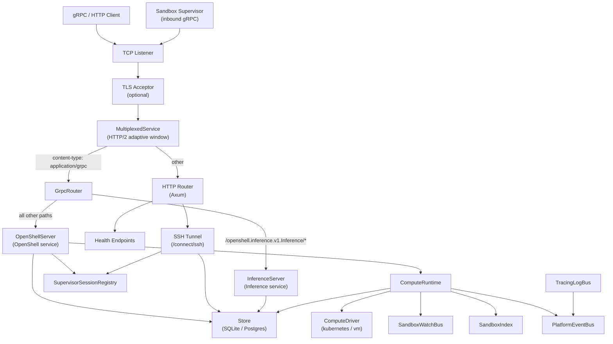
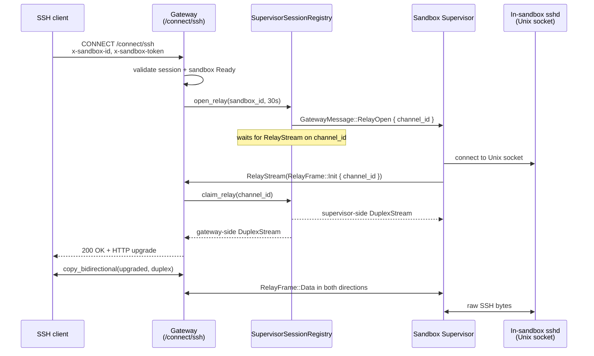
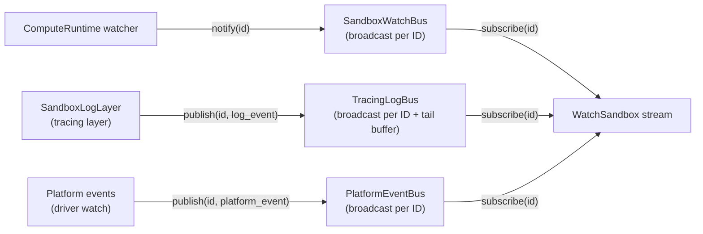

# Gateway Architecture

## Overview

`openshell-server` is the gateway -- the central control plane for a cluster. It exposes two gRPC services (OpenShell and Inference) and HTTP endpoints on a single multiplexed port, manages sandbox lifecycle through a pluggable compute driver, persists state in SQLite or Postgres, and brokers SSH access into sandboxes through supervisor-initiated relay streams. The gateway coordinates all interactions between clients, the compute backend, and the persistence layer.

Each sandbox supervisor opens a persistent inbound gRPC session (`ConnectSupervisor`); the gateway multiplexes per-invocation `RelayStream` RPCs onto the same HTTP/2 connection to move bytes between clients and the in-sandbox SSH Unix socket. The gateway does not need to know, resolve, or reach the sandbox's network address.

## Architecture Diagram

The following diagram shows the major components inside the gateway process and their relationships.



## Source Layout

| Module | File | Purpose |
|--------|------|---------|
| Entry point | `crates/openshell-server/src/main.rs` | Thin binary wrapper that calls `cli::run_cli` |
| CLI | `crates/openshell-server/src/cli.rs` | `Args` parser, config assembly, tracing setup, calls `run_server` |
| Gateway runtime | `crates/openshell-server/src/lib.rs` | `ServerState` struct, `run_server()` accept loop |
| Protocol mux | `crates/openshell-server/src/multiplex.rs` | `MultiplexService`, `MultiplexedService`, `GrpcRouter`, `BoxBody`, HTTP/2 adaptive-window tuning |
| gRPC: OpenShell | `crates/openshell-server/src/grpc/mod.rs` | `OpenShellService` trait impl -- dispatches to per-concern handlers |
| gRPC: Sandbox/Exec | `crates/openshell-server/src/grpc/sandbox.rs` | Sandbox CRUD, `ExecSandbox`, SSH session handlers, relay-backed exec proxy |
| gRPC: Inference | `crates/openshell-server/src/inference.rs` | `InferenceService` -- cluster inference config and sandbox bundle delivery |
| Supervisor sessions | `crates/openshell-server/src/supervisor_session.rs` | `SupervisorSessionRegistry`, `handle_connect_supervisor`, `handle_relay_stream`, reaper |
| HTTP | `crates/openshell-server/src/http.rs` | Health endpoints, merged with SSH tunnel router |
| Browser auth | `crates/openshell-server/src/auth.rs` | Cloudflare browser login relay at `/auth/connect` |
| SSH tunnel | `crates/openshell-server/src/ssh_tunnel.rs` | HTTP CONNECT handler at `/connect/ssh` backed by `open_relay` |
| WS tunnel | `crates/openshell-server/src/ws_tunnel.rs` | WebSocket tunnel handler at `/_ws_tunnel` for Cloudflare-fronted clients |
| TLS | `crates/openshell-server/src/tls.rs` | `TlsAcceptor` wrapping rustls with ALPN |
| Persistence | `crates/openshell-server/src/persistence/mod.rs` | `Store` enum (SQLite/Postgres), generic object CRUD, protobuf codec |
| Compute runtime | `crates/openshell-server/src/compute/mod.rs` | `ComputeRuntime`, gateway-owned sandbox lifecycle orchestration over a compute backend |
| Compute driver: Kubernetes | `crates/openshell-driver-kubernetes/src/driver.rs` | Kubernetes CRD create/delete/watch, pod template translation |
| Compute driver: VM | `crates/openshell-driver-vm/src/driver.rs` | Per-sandbox microVM create/delete/watch, supervisor-only guest boot |
| Sandbox index | `crates/openshell-server/src/sandbox_index.rs` | `SandboxIndex` -- in-memory name/pod-to-id correlation |
| Watch bus | `crates/openshell-server/src/sandbox_watch.rs` | `SandboxWatchBus` -- in-memory broadcast for persisted sandbox updates |
| Tracing bus | `crates/openshell-server/src/tracing_bus.rs` | `TracingLogBus` -- captures tracing events keyed by `sandbox_id` |

Proto definitions consumed by the gateway:

| Proto file | Package | Defines |
|------------|---------|---------|
| `proto/openshell.proto` | `openshell.v1` | `OpenShell` service, public sandbox resource model, provider/SSH/watch/policy messages, supervisor session messages (`ConnectSupervisor`, `RelayStream`, `RelayFrame`) |
| `proto/compute_driver.proto` | `openshell.compute.v1` | Internal `ComputeDriver` service, driver-native sandbox observations, compute watch stream envelopes |
| `proto/inference.proto` | `openshell.inference.v1` | `Inference` service: `SetClusterInference`, `GetClusterInference`, `GetInferenceBundle` |
| `proto/datamodel.proto` | `openshell.datamodel.v1` | `Provider` |
| `proto/sandbox.proto` | `openshell.sandbox.v1` | Sandbox supervisor policy, settings, and config messages |

## Startup Sequence

The gateway boots in `cli::run_cli` (`crates/openshell-server/src/cli.rs`) and proceeds through these steps:

1. **Install rustls crypto provider** -- `rustls::crypto::ring::default_provider().install_default()`.
2. **Parse CLI arguments** -- `Args::parse()` via `clap`. Every flag has a corresponding environment variable (see [Configuration](#configuration)).
3. **Initialize tracing** -- Creates a `TracingLogBus` and installs a tracing subscriber that writes to stdout and publishes log events keyed by `sandbox_id` into the bus.
4. **Build `Config`** -- Assembles an `openshell_core::Config` from the parsed arguments.
5. **Call `run_server()`** (`crates/openshell-server/src/lib.rs`):
   1. Connect to the persistence store (`Store::connect`), which auto-detects SQLite vs Postgres from the URL prefix and runs migrations.
   2. Create `ComputeRuntime` with a `ComputeDriver` implementation selected by `OPENSHELL_DRIVERS`:
      - `kubernetes` wraps `KubernetesComputeDriver` in `ComputeDriverService`, so the gateway uses the `openshell.compute.v1.ComputeDriver` RPC surface even without transport.
      - `vm` spawns the standalone `openshell-driver-vm` binary as a local compute-driver process, resolves it from `--driver-dir`, conventional libexec install paths, or a sibling of the gateway binary, connects to it over a Unix domain socket, and keeps the libkrun/rootfs runtime out of the gateway binary.
   3. Build `ServerState` (shared via `Arc<ServerState>` across all handlers), including a fresh `SupervisorSessionRegistry`.
   4. **Spawn background tasks**:
      - `ComputeRuntime::spawn_watchers` -- consumes the compute-driver watch stream, republishes platform events, and runs a periodic `ListSandboxes` snapshot reconcile.
      - `ssh_tunnel::spawn_session_reaper` -- sweeps expired or revoked SSH session tokens from the store hourly.
      - `supervisor_session::spawn_relay_reaper` -- sweeps orphaned pending relay channels every 30 seconds.
   5. Create `MultiplexService`.
   6. Bind `TcpListener` on `config.bind_address`.
   7. Optionally create `TlsAcceptor` from cert/key files.
   8. Enter the accept loop: for each connection, spawn a tokio task that optionally performs a TLS handshake, then calls `MultiplexService::serve()`.

## Configuration

All configuration is via CLI flags with environment variable fallbacks. The `--db-url` and `--ssh-handshake-secret` flags are required.

| Flag | Env Var | Default | Description |
|------|---------|---------|-------------|
| `--port` | `OPENSHELL_SERVER_PORT` | `8080` | TCP listen port (binds `0.0.0.0`) |
| `--log-level` | `OPENSHELL_LOG_LEVEL` | `info` | Tracing log level filter |
| `--tls-cert` | `OPENSHELL_TLS_CERT` | None | Path to PEM certificate file |
| `--tls-key` | `OPENSHELL_TLS_KEY` | None | Path to PEM private key file |
| `--tls-client-ca` | `OPENSHELL_TLS_CLIENT_CA` | None | Path to PEM CA cert for mTLS client verification |
| `--disable-tls` | `OPENSHELL_DISABLE_TLS` | `false` | Listen on plaintext HTTP behind a trusted reverse proxy or tunnel |
| `--disable-gateway-auth` | `OPENSHELL_DISABLE_GATEWAY_AUTH` | `false` | Keep TLS enabled but allow no-certificate clients and rely on application-layer auth |
| `--client-tls-secret-name` | `OPENSHELL_CLIENT_TLS_SECRET_NAME` | None | K8s secret name to mount into sandbox pods for mTLS |
| `--db-url` | `OPENSHELL_DB_URL` | *required* | Database URL (`sqlite:...` or `postgres://...`). The Helm chart defaults to `sqlite:/var/openshell/openshell.db` (persistent volume). In-memory SQLite (`sqlite::memory:?cache=shared`) works for ephemeral/test environments but data is lost on restart. |
| `--sandbox-namespace` | `OPENSHELL_SANDBOX_NAMESPACE` | `default` | Kubernetes namespace for sandbox CRDs |
| `--sandbox-image` | `OPENSHELL_SANDBOX_IMAGE` | None | Default container image for sandbox pods |
| `--grpc-endpoint` | `OPENSHELL_GRPC_ENDPOINT` | None | gRPC endpoint reachable from within the cluster (for supervisor callbacks) |
| `--drivers` | `OPENSHELL_DRIVERS` | `kubernetes` | Compute backend to use. Current options are `kubernetes` and `vm`. |
| `--vm-driver-state-dir` | `OPENSHELL_VM_DRIVER_STATE_DIR` | `target/openshell-vm-driver` | Host directory for VM sandbox rootfs, console logs, and runtime state |
| `--driver-dir` | `OPENSHELL_DRIVER_DIR` | unset | Override directory for `openshell-driver-vm`. When unset, the gateway searches `~/.local/libexec/openshell`, `/usr/local/libexec/openshell`, `/usr/local/libexec`, then a sibling binary. |
| `--vm-krun-log-level` | `OPENSHELL_VM_KRUN_LOG_LEVEL` | `1` | libkrun log level for VM helper processes |
| `--vm-driver-vcpus` | `OPENSHELL_VM_DRIVER_VCPUS` | `2` | Default vCPU count for VM sandboxes |
| `--vm-driver-mem-mib` | `OPENSHELL_VM_DRIVER_MEM_MIB` | `2048` | Default memory allocation for VM sandboxes in MiB |
| `--vm-tls-ca` | `OPENSHELL_VM_TLS_CA` | None | CA cert copied into VM guests for gateway mTLS |
| `--vm-tls-cert` | `OPENSHELL_VM_TLS_CERT` | None | Client cert copied into VM guests for gateway mTLS |
| `--vm-tls-key` | `OPENSHELL_VM_TLS_KEY` | None | Client private key copied into VM guests for gateway mTLS |
| `--ssh-gateway-host` | `OPENSHELL_SSH_GATEWAY_HOST` | `127.0.0.1` | Public hostname returned in SSH session responses |
| `--ssh-gateway-port` | `OPENSHELL_SSH_GATEWAY_PORT` | `8080` | Public port returned in SSH session responses |
| `--ssh-connect-path` | `OPENSHELL_SSH_CONNECT_PATH` | `/connect/ssh` | HTTP path for SSH CONNECT/upgrade |

The sandbox-side SSH listener is a Unix domain socket inside the sandbox. The path defaults to `/run/openshell/ssh.sock` and is configured on the compute driver (e.g. `openshell-driver-kubernetes --sandbox-ssh-socket-path`). The gateway never dials this socket itself; the supervisor bridges it onto a `RelayStream` when asked.

## Shared State

All handlers share an `Arc<ServerState>` (`crates/openshell-server/src/lib.rs`):

```rust
pub struct ServerState {
    pub config: Config,
    pub store: Arc<Store>,
    pub compute: ComputeRuntime,
    pub sandbox_index: SandboxIndex,
    pub sandbox_watch_bus: SandboxWatchBus,
    pub tracing_log_bus: TracingLogBus,
    pub ssh_connections_by_token: Mutex<HashMap<String, u32>>,
    pub ssh_connections_by_sandbox: Mutex<HashMap<String, u32>>,
    pub settings_mutex: tokio::sync::Mutex<()>,
    pub supervisor_sessions: SupervisorSessionRegistry,
}
```

- **`store`** -- persistence backend (SQLite or Postgres) for all object types.
- **`compute`** -- gateway-owned compute orchestration. Persists sandbox lifecycle transitions, validates create requests through the compute backend, consumes the backend watch stream, and periodically reconciles the store against `ComputeDriver/ListSandboxes` snapshots.
- **`sandbox_index`** -- in-memory bidirectional index mapping sandbox names and agent pod names to sandbox IDs. Updated from compute-driver sandbox snapshots.
- **`sandbox_watch_bus`** -- `broadcast`-based notification bus keyed by sandbox ID. Producers call `notify(&id)` when the persisted sandbox record changes; consumers in `WatchSandbox` streams receive `()` signals and re-read the record.
- **`tracing_log_bus`** -- captures `tracing` events that include a `sandbox_id` field and republishes them as `SandboxLogLine` messages. Maintains a per-sandbox tail buffer (default 200 entries). Also contains a nested `PlatformEventBus` for compute-driver platform events.
- **`supervisor_sessions`** -- tracks the live `ConnectSupervisor` session per sandbox and the set of pending relay channels awaiting the supervisor's `RelayStream` dial-back. See [Supervisor Sessions](#supervisor-sessions).
- **`settings_mutex`** -- serializes settings mutations (global and sandbox) to prevent read-modify-write races. See [Gateway Settings Channel](gateway-settings.md#global-policy-lifecycle).

## Protocol Multiplexing

All traffic (gRPC and HTTP) shares a single TCP port. Multiplexing happens at the request level, not the connection level.

### Connection Handling

`MultiplexService::serve()` (`crates/openshell-server/src/multiplex.rs`) creates per-connection service instances:

1. Each accepted TCP stream (optionally TLS-wrapped) is passed to `hyper_util::server::conn::auto::Builder`, which auto-negotiates HTTP/1.1 or HTTP/2.
2. The HTTP/2 side is built with `adaptive_window(true)`. Hyper/h2 auto-sizes the per-stream flow-control window based on measured bandwidth-delay product, so bulk byte transfers on `RelayStream` (and `ExecSandbox` / `PushSandboxLogs`) are not throttled by the default 64 KiB window. Idle streams stay cheap; active streams grow as needed.
3. The builder calls `serve_connection_with_upgrades()`, which supports HTTP upgrades (needed for the SSH tunnel's CONNECT method).
4. For each request, `MultiplexedService` inspects the `content-type` header:
   - **Starts with `application/grpc`** -- routes to `GrpcRouter`.
   - **Anything else** -- routes to the Axum HTTP router.

### gRPC Sub-Routing

`GrpcRouter` (`crates/openshell-server/src/multiplex.rs`) further routes gRPC requests by URI path prefix:

- Paths starting with `/openshell.inference.v1.Inference/` go to `InferenceServer`.
- All other gRPC paths go to `OpenShellServer`.

### Body Type Normalization

Both gRPC and HTTP handlers produce different response body types. `MultiplexedService` normalizes them through a custom `BoxBody` wrapper (an `UnsyncBoxBody<Bytes, Box<dyn Error>>`) so that Hyper receives a uniform response type.

### TLS + mTLS

When TLS is enabled (`crates/openshell-server/src/tls.rs`):

- `TlsAcceptor::from_files()` loads PEM certificates and keys via `rustls_pemfile`, builds a `rustls::ServerConfig`, and configures ALPN to advertise `h2` and `http/1.1`.
- When a client CA path is provided (`--tls-client-ca`), the server enforces mutual TLS using `WebPkiClientVerifier` by default. In Cloudflare-fronted deployments, `--disable-gateway-auth` keeps TLS enabled but allows no-certificate clients so the edge can forward a JWT instead.
- `--disable-tls` removes gateway-side TLS entirely and serves plaintext HTTP behind a trusted reverse proxy or tunnel.
- Supports PKCS#1, PKCS#8, and SEC1 private key formats.
- The TLS handshake happens before the stream reaches Hyper's auto builder, so ALPN negotiation and HTTP version detection work together transparently.
- Certificates are generated at cluster bootstrap time by the `openshell-bootstrap` crate using `rcgen`, not by a Helm Job. The bootstrap reconciles three K8s secrets: `openshell-server-tls` (server cert+key), `openshell-server-client-ca` (CA cert), and `openshell-client-tls` (client cert+key+CA, shared by CLI and sandbox pods).
- Sandbox supervisors reuse the shared client cert to authenticate their `ConnectSupervisor` and `RelayStream` calls over the same mTLS channel.

## Supervisor Sessions

The gateway brokers all byte-level access into a sandbox through a two-plane design on a single HTTP/2 connection initiated by the supervisor:

1. **Control plane** -- `ConnectSupervisor(stream SupervisorMessage) returns (stream GatewayMessage)`. Long-lived, one per sandbox. Carries `SupervisorHello`, `SessionAccepted`/`SessionRejected`, heartbeats, and `RelayOpen`/`RelayClose` control messages.
2. **Data plane** -- `RelayStream(stream RelayFrame) returns (stream RelayFrame)`. One short-lived call per SSH or exec invocation. The first inbound frame is a `RelayInit { channel_id }`; subsequent frames carry raw bytes in `RelayFrame.data` in either direction.

Both RPCs are defined in `proto/openshell.proto` and ride the same TCP + TLS + HTTP/2 connection from the supervisor. No new TLS handshake, no reverse HTTP CONNECT, no direct gateway-to-pod dial.

### `SupervisorSessionRegistry`

`crates/openshell-server/src/supervisor_session.rs` defines `SupervisorSessionRegistry`, a single instance of which lives on `ServerState.supervisor_sessions`. It holds two maps guarded by `std::sync::Mutex`:

- `sessions: HashMap<sandbox_id, LiveSession>` -- one entry per connected supervisor. Each `LiveSession` carries a unique `session_id`, the `mpsc::Sender<GatewayMessage>` for the outbound stream, and a connection timestamp.
- `pending_relays: HashMap<channel_id, PendingRelay>` -- one entry per in-flight `open_relay` call awaiting the supervisor's `RelayStream` dial-back. Each `PendingRelay` wraps a `oneshot::Sender<DuplexStream>` and a creation timestamp.

Core operations:

| Method | Purpose |
|--------|---------|
| `register(sandbox_id, session_id, tx)` | Insert a live session; returns the previous session's sender (if any) so the caller can close it. Used by `handle_connect_supervisor` when a supervisor reconnects. |
| `remove_if_current(sandbox_id, session_id)` | Remove the session only if its `session_id` still matches. Guards against the supersede race where an old session's cleanup task fires after a newer session already registered. |
| `open_relay(sandbox_id, session_wait_timeout)` | Wait up to `session_wait_timeout` for a live session, allocate a fresh `channel_id` (UUID v4), insert the pending slot, send `RelayOpen { channel_id }` to the supervisor, and return `(channel_id, oneshot::Receiver<DuplexStream>)`. The receiver resolves once the supervisor's `RelayStream` arrives and `claim_relay` pairs them up. |
| `claim_relay(channel_id)` | Consume the pending slot, construct a `tokio::io::duplex(64 KiB)` pair, hand the gateway-side half to the waiter via the oneshot, and return the supervisor-side half to `handle_relay_stream`. |
| `reap_expired_relays()` | Drop pending relays older than 10 s. Called by `spawn_relay_reaper` on a 30 s cadence. |

Session wait uses exponential backoff from 100 ms to 2 s while polling the sessions map. Pending-relay expiry is fixed at `RELAY_PENDING_TIMEOUT = 10 s`.

### `handle_connect_supervisor`

Lifecycle of a supervisor session:

1. Read the first `SupervisorMessage`; require `payload = Hello { sandbox_id, instance_id }` and a non-empty `sandbox_id`.
2. Allocate a fresh `session_id` (UUID v4) and create an `mpsc::channel::<GatewayMessage>(64)` for the outbound stream.
3. Call `registry.register(...)`. If it returns a previous sender, log that the previous session was superseded (dropping the previous `tx` closes the old outbound stream).
4. Send `SessionAccepted { session_id, heartbeat_interval_secs: 15 }`. If the send fails, call `remove_if_current` (so a concurrent reconnect isn't evicted) and return `Internal`.
5. Spawn a session loop that `select!`s between inbound messages and a 15 s heartbeat timer. Inbound heartbeats are silent; `RelayOpenResult` is logged; `RelayClose` is logged; unknown payloads are logged as warnings.
6. When the loop exits (inbound EOF, inbound error, or outbound channel closed), `remove_if_current` drops the registration -- unless a newer session has already replaced it.

### `handle_relay_stream`

Lifecycle of one relay call:

1. Read the first inbound `RelayFrame`; require `payload = Init { channel_id }` with a non-empty `channel_id`. Reject anything else with `InvalidArgument`.
2. Call `registry.claim_relay(channel_id)`. Returns `NotFound` if the channel is unknown or already expired, `DeadlineExceeded` if older than 10 s, or `Internal` if the waiter has dropped the oneshot receiver.
3. Split the supervisor-side `DuplexStream` into read and write halves and spawn two tasks:
   - **Supervisor → gateway**: pull `RelayFrame`s from the inbound stream, accept `Data(bytes)`, write to the duplex write-half. On non-data frames, warn and break. Best-effort `shutdown()` on exit so the reader sees EOF.
   - **Gateway → supervisor**: read up to `RELAY_STREAM_CHUNK_SIZE = 16 KiB` at a time from the duplex read-half and emit `RelayFrame { Data }` messages on an outbound `mpsc::channel(16)`.
4. Return the outbound receiver as the RPC response stream.

### Connect Flow (SSH Tunnel)



Timeouts on the tunnel path:

- `open_relay` session wait: **30 s**. A first `sandbox connect` immediately after `sandbox create` must cover the supervisor's initial TLS + gRPC handshake on a cold pod.
- `relay_rx` delivery timeout: 10 s. Covers the round-trip from the `RelayOpen` message to the supervisor's `RelayStream` dial-back.

Per-token and per-sandbox concurrent-tunnel limits (3 and 20 respectively) are still enforced before the upgrade.

### Exec Flow

`ExecSandbox` reuses the same machinery from `grpc/sandbox.rs`:

1. Validate the request (`sandbox_id`, `command`, env-key format, other field rules), fetch the sandbox, require `Ready` phase.
2. `state.supervisor_sessions.open_relay(&sandbox.id, 15s)` -- shorter timeout than SSH connect, because exec is typically called mid-lifetime after the supervisor session is already established.
3. Wait up to 10 s for the relay `DuplexStream`.
4. `stream_exec_over_relay`: bind an ephemeral localhost TCP listener, bridge that single-use TCP socket to the relay duplex, and drive a `russh` client through the local port. The `russh` session opens a channel, executes the shell-escaped command, and streams `ExecSandboxStdout`/`ExecSandboxStderr` chunks to the caller. On completion, send `ExecSandboxExit { exit_code }`.
5. On timeout (if `timeout_seconds > 0`), emit exit code 124 (matching `timeout(1)`).

The supervisor-side SSH daemon is an SSH server bound to a Unix domain socket inside the sandbox's filesystem. Filesystem permissions on that socket are the only access-control boundary between the supervisor bridge and the daemon; all higher-level authorization is enforced at `CreateSshSession` / `ExecSandbox` in the gateway.

### Regression Coverage

`crates/openshell-server/tests/supervisor_relay_integration.rs` is the regression guard for the `RelayStream` wire protocol. It stands up an in-process tonic server that mounts the real `handle_relay_stream` behind `MultiplexedService`, connects a mock supervisor client over a real tonic `Channel`, and exercises the registry's `open_relay` → `claim_relay` pairing end to end with `tokio::io::duplex` bridging. The five test cases cover:

- Round-trip bytes from gateway to supervisor and back (echo loop).
- Clean close when the gateway drops the relay.
- EOF propagation when the supervisor closes its outbound sender.
- `Unavailable` when `open_relay` is called without a registered session.
- Concurrent `RelayStream` calls multiplexed independently on the same connection.

These complement the unit tests inside `supervisor_session.rs` (registry-only behavior) and the live cluster tests (full CLI → gateway → sandbox path).

## gRPC Services

### OpenShell Service

Defined in `proto/openshell.proto`, implemented in `crates/openshell-server/src/grpc/mod.rs` as `OpenShellService`. Per-concern handlers live in `crates/openshell-server/src/grpc/` submodules.

#### Sandbox Management

| RPC | Description | Key behavior |
|-----|-------------|--------------|
| `Health` | Returns service status and version | Always returns `HEALTHY` with `CARGO_PKG_VERSION` |
| `CreateSandbox` | Create a new sandbox | Validates spec and policy, validates provider names exist (fail-fast), persists to store, creates the compute-driver sandbox. On driver failure, rolls back the store record and index entry. |
| `GetSandbox` | Fetch sandbox by name | Looks up by name via `store.get_message_by_name()` |
| `ListSandboxes` | List sandboxes | Paginated (default limit 100), decodes protobuf payloads from store records |
| `DeleteSandbox` | Delete sandbox by name | Sets phase to `Deleting`, persists, notifies watch bus, then deletes via the compute driver. Cleans up store if the sandbox was already gone. |
| `WatchSandbox` | Stream sandbox updates | Server-streaming RPC. See [Watch Sandbox Stream](#watch-sandbox-stream) below. |
| `ExecSandbox` | Execute command in sandbox | Server-streaming RPC; data plane runs through `SupervisorSessionRegistry::open_relay`. See [Exec Flow](#exec-flow). |

#### Supervisor Session

| RPC | Description |
|-----|-------------|
| `ConnectSupervisor` | Persistent bidi stream from the sandbox supervisor. Carries hello/accept/heartbeat/`RelayOpen`/`RelayClose`. One session per sandbox; reconnects supersede. |
| `RelayStream` | Per-invocation bidi byte bridge. Supervisor initiates after receiving `RelayOpen`; first frame is `RelayInit { channel_id }`; subsequent frames carry raw bytes. |

Neither RPC is called by end users. They are the private control/data plane between the gateway and each sandbox supervisor.

#### SSH Session Management

| RPC | Description |
|-----|-------------|
| `CreateSshSession` | Creates a session token for a `Ready` sandbox. Persists an `SshSession` record and returns gateway connection details (host, port, scheme, connect path). The resulting token is presented on the `/connect/ssh` HTTP CONNECT request. |
| `RevokeSshSession` | Marks a session as revoked by setting `session.revoked = true` in the store. |

#### Provider Management

Full CRUD for `Provider` objects, which store typed credentials (e.g., API keys for Claude, GitLab tokens).

| RPC | Description |
|-----|-------------|
| `CreateProvider` | Creates a provider. Requires `type` field; auto-generates a 6-char name if not provided. Rejects duplicates by name. |
| `GetProvider` | Fetches a provider by name. |
| `ListProviders` | Paginated list (default limit 100). |
| `UpdateProvider` | Updates an existing provider by name. Preserves the stored `id` and `name`; replaces `type`, `credentials`, and `config`. |
| `DeleteProvider` | Deletes a provider by name. Returns `deleted: true/false`. |

#### Policy, Settings, and Provider Environment Delivery

These RPCs are called by sandbox supervisors at startup and during runtime polling.

| RPC | Description |
|-----|-------------|
| `GetSandboxConfig` | Returns effective sandbox config looked up by sandbox ID: policy payload, policy metadata (version, hash, source, `global_policy_version`), merged effective settings, and a `config_revision` fingerprint for change detection. Two-tier resolution: registered keys start unset, sandbox values overlay, global values override. The reserved `policy` key in global settings can override the sandbox's own policy. When a global policy is active, `policy_source` is `GLOBAL` and `global_policy_version` carries the active revision number. See [Gateway Settings Channel](gateway-settings.md). |
| `GetGatewayConfig` | Returns gateway-global settings only (excluding the reserved `policy` key). Returns registered keys with empty values when unconfigured, and a monotonic `settings_revision`. |
| `GetSandboxProviderEnvironment` | Resolves provider credentials into environment variables for a sandbox. Iterates the sandbox's `spec.providers` list, fetches each `Provider`, and collects credential key-value pairs. First provider wins on duplicate keys. Skips credential keys that do not match `^[A-Za-z_][A-Za-z0-9_]*$`. |

#### Policy Recommendation (Network Rules)

These RPCs support the sandbox-initiated policy recommendation pipeline. The sandbox generates proposals via its mechanistic mapper and submits them; the gateway validates, persists, and manages the approval workflow. See [policy-advisor.md](policy-advisor.md) for the full pipeline design.

| RPC | Description |
|-----|-------------|
| `SubmitPolicyAnalysis` | Receives pre-formed `PolicyChunk` proposals from a sandbox. Validates each chunk, persists via upsert on `(sandbox_id, host, port, binary)` dedup key, notifies watch bus. |
| `GetDraftPolicy` | Returns all draft chunks for a sandbox with current draft version. |
| `ApproveDraftChunk` | Approves a pending or rejected chunk. Merges the proposed rule into the active policy (appends binary to existing rule or inserts new rule). **Blocked when a global policy is active** -- returns `FailedPrecondition`. |
| `RejectDraftChunk` | Rejects a pending chunk or revokes an approved chunk. If revoking, removes the binary from the active policy rule. Rejection of `pending` chunks is always allowed. **Revoking approved chunks is blocked when a global policy is active** -- returns `FailedPrecondition`. |
| `ApproveAllDraftChunks` | Bulk approves all pending chunks for a sandbox. **Blocked when a global policy is active** -- returns `FailedPrecondition`. |
| `EditDraftChunk` | Updates the proposed rule on a pending chunk. |
| `GetDraftHistory` | Returns all chunks (including rejected) for audit trail. |

### Inference Service

Defined in `proto/inference.proto`, implemented in `crates/openshell-server/src/inference.rs` as `InferenceService`.

The gateway acts as the control plane for inference configuration. It stores a single managed cluster inference route (named `inference.local`) and delivers resolved route bundles to sandbox pods. The gateway does not execute inference requests -- sandboxes connect directly to inference backends using the credentials and endpoints provided in the bundle.

#### Cluster Inference Configuration

The gateway manages a single cluster-wide inference route that maps to a provider record. When set, the route stores only a `provider_name` and `model_id` reference. At bundle resolution time, the gateway looks up the referenced provider and derives the endpoint URL, API key, protocols, and provider type from it. This late-binding design means provider credential rotations are automatically reflected in the next bundle fetch without updating the route itself.

| RPC | Description |
|-----|-------------|
| `SetClusterInference` | Configures the cluster inference route. Validates `provider_name` and `model_id` are non-empty, verifies the named provider exists and has a supported type for inference (openai, anthropic, nvidia), validates the provider has a usable API key, then upserts the `inference.local` route record. Increments a monotonic `version` on each update. Returns the configured `provider_name`, `model_id`, and `version`. |
| `GetClusterInference` | Returns the current cluster inference configuration (`provider_name`, `model_id`, `version`). Returns `NotFound` if no cluster inference is configured, or `FailedPrecondition` if the stored route has empty provider/model metadata. |
| `GetInferenceBundle` | Returns the resolved inference route bundle for sandbox consumption. See [Route Bundle Delivery](#route-bundle-delivery) below. |

#### Route Bundle Delivery

The `GetInferenceBundle` RPC resolves the managed cluster route into a `GetInferenceBundleResponse` containing fully materialized route data that sandboxes can use directly.

The trait method delegates to `resolve_inference_bundle(store)` (`crates/openshell-server/src/inference.rs`), which takes `&Store` instead of `&self`. This extraction decouples bundle resolution from `ServerState`, enabling direct unit testing against an in-memory SQLite store without constructing a full server.

The `GetInferenceBundleResponse` includes:

- **`routes`** -- a list of `ResolvedRoute` messages containing base URL, model ID, API key, protocols, and provider type. Currently contains zero or one routes (the managed cluster route).
- **`revision`** -- a hex-encoded hash computed from route contents. Sandboxes compare this value to detect when their route set has changed.
- **`generated_at_ms`** -- epoch milliseconds when the bundle was assembled.

#### Provider-Based Route Resolution

Managed route resolution in `resolve_managed_cluster_route()` (`crates/openshell-server/src/inference.rs`):

1. Load the managed route by name (`inference.local`).
2. Skip (return `None`) if the route does not exist, has no spec, or is disabled.
3. Validate that `provider_name` and `model_id` are non-empty.
4. Fetch the referenced provider record from the store.
5. Resolve the provider into a `ResolvedProviderRoute` via `resolve_provider_route()`:
   - Look up the `InferenceProviderProfile` for the provider's type via `openshell_core::inference::profile_for()`. Supported types: `openai`, `anthropic`, `nvidia`.
   - Search the provider's credentials map for an API key using the profile's preferred key name (e.g., `OPENAI_API_KEY`), falling back to the first non-empty credential in sorted key order.
   - Resolve the base URL from the provider's config map using the profile-specific key (e.g., `OPENAI_BASE_URL`), falling back to the profile's default URL.
   - Derive protocols from the profile (e.g., `openai_chat_completions`, `openai_completions`, `openai_responses`, `model_discovery` for OpenAI-compatible providers).
6. Return a `ResolvedRoute` with the fully materialized endpoint, credentials, and protocols.

The `ClusterInferenceConfig` stored in the database contains only `provider_name` and `model_id`. All other fields (endpoint, credentials, protocols, auth style) are resolved from the provider record at bundle generation time via `build_cluster_inference_config()`.

## HTTP Endpoints

The HTTP router (`crates/openshell-server/src/http.rs`) merges two sub-routers:

### Health Endpoints

| Path | Method | Response |
|------|--------|----------|
| `/health` | GET | `200 OK` (empty body) |
| `/healthz` | GET | `200 OK` (empty body) -- Kubernetes liveness probe |
| `/readyz` | GET | `200 OK` with JSON `{"status": "healthy", "version": "<version>"}` -- Kubernetes readiness probe |

### SSH Tunnel Endpoint

| Path | Method | Response |
|------|--------|----------|
| `/connect/ssh` | CONNECT | Upgrades the connection to a bidirectional byte bridge tunneled through `SupervisorSessionRegistry::open_relay` |

See [Connect Flow (SSH Tunnel)](#connect-flow-ssh-tunnel) for details.

### Cloudflare Endpoints

| Path | Method | Response |
|------|--------|----------|
| `/auth/connect` | GET | Browser login relay page that reads `CF_Authorization` and POSTs it back to the CLI localhost callback |
| `/_ws_tunnel` | GET upgrade | WebSocket tunnel that bridges bytes directly into `MultiplexedService` over an in-memory duplex stream |

## Watch Sandbox Stream

The `WatchSandbox` RPC (`crates/openshell-server/src/grpc/`) provides a multiplexed server-streaming response that can include sandbox status snapshots, gateway log lines, and platform events.

### Request Options

The `WatchSandboxRequest` controls what the stream includes:

- `follow_status` -- subscribe to `SandboxWatchBus` notifications and re-read the sandbox record on each change.
- `follow_logs` -- subscribe to `TracingLogBus` for gateway log lines correlated by `sandbox_id`.
- `follow_events` -- subscribe to `PlatformEventBus` for compute-driver platform events correlated to the sandbox.
- `log_tail_lines` -- replay the last N log lines before following (default 200).
- `stop_on_terminal` -- end the stream when the sandbox reaches the `Ready` phase. Note: `Error` phase does not stop the stream because it may be transient (e.g., `ReconcilerError`).

### Stream Protocol

1. Subscribe to all requested buses **before** reading the initial snapshot (prevents missed notifications).
2. Send the current sandbox record as the first event.
3. If `stop_on_terminal` is set and the sandbox is already `Ready`, end the stream immediately.
4. Replay tail logs if `follow_logs` is enabled.
5. Enter a `tokio::select!` loop listening on up to three broadcast receivers:
   - **Status updates**: re-read the sandbox from the store, send the snapshot, check for terminal phase.
   - **Log lines**: forward `SandboxStreamEvent::Log` messages.
   - **Platform events**: forward `SandboxStreamEvent::Event` messages.

### Event Bus Architecture



All buses use `tokio::sync::broadcast` channels keyed by sandbox ID. Buffer sizes:
- `SandboxWatchBus`: 128 (signals only, no payload -- just `()`)
- `TracingLogBus`: 1024 (full `SandboxStreamEvent` payloads)
- `PlatformEventBus`: 1024 (full `SandboxStreamEvent` payloads)

Broadcast lag is translated to `Status::resource_exhausted` via `broadcast_to_status()`.

**Cleanup:** Each bus exposes a `remove(sandbox_id)` method that drops the broadcast sender (closing active receivers with `RecvError::Closed`) and frees internal map entries. Cleanup is wired into the compute watch reconciler, the periodic snapshot reconcile for sandboxes missing from the driver, and the `delete_sandbox` gRPC handler to prevent unbounded memory growth from accumulated entries for deleted sandboxes.

**Validation:** `WatchSandbox` validates that the sandbox exists before subscribing to any bus, preventing entries from being created for non-existent IDs. `PushSandboxLogs` validates sandbox existence once on the first batch of the stream.

## Persistence Layer

### Store Architecture

The `Store` enum (`crates/openshell-server/src/persistence/mod.rs`) dispatches to either `SqliteStore` or `PostgresStore` based on the database URL prefix:

- `sqlite:*` -- uses `sqlx::SqlitePool` (1 connection for in-memory, 5 for file-based).
- `postgres://` or `postgresql://` -- uses `sqlx::PgPool` (max 10 connections).

Both backends auto-run migrations on connect from `crates/openshell-server/migrations/{sqlite,postgres}/`.

### Schema

A single `objects` table stores all object types:

```sql
CREATE TABLE objects (
    object_type TEXT NOT NULL,
    id          TEXT NOT NULL,
    name        TEXT NOT NULL,
    payload     BLOB NOT NULL,
    created_at_ms INTEGER NOT NULL,
    updated_at_ms INTEGER NOT NULL,
    PRIMARY KEY (id),
    UNIQUE (object_type, name)
);
```

Objects are identified by `(object_type, id)` with a unique constraint on `(object_type, name)`. The `payload` column stores protobuf-encoded bytes.

### Object Types

| Object type string | Proto message / format | Traits implemented | Notes |
|--------------------|------------------------|-------------------|-------|
| `"sandbox"` | `Sandbox` | `ObjectType`, `ObjectId`, `ObjectName` | |
| `"provider"` | `Provider` | `ObjectType`, `ObjectId`, `ObjectName` | |
| `"ssh_session"` | `SshSession` | `ObjectType`, `ObjectId`, `ObjectName` | |
| `"inference_route"` | `InferenceRoute` | `ObjectType`, `ObjectId`, `ObjectName` | |
| `"gateway_settings"` | JSON `StoredSettings` | Generic `put`/`get` | Singleton, id=`"global"`. Contains the reserved `policy` key for global policy delivery. |
| `"sandbox_settings"` | JSON `StoredSettings` | Generic `put`/`get` | Per-sandbox, id=`"settings:{sandbox_uuid}"` |

The `sandbox_policies` table stores versioned policy revisions for both sandbox-scoped and global policies. Global revisions use the sentinel `sandbox_id = "__global__"`. See [Gateway Settings Channel](gateway-settings.md#storage-model) for schema details.

### Generic Protobuf Codec

The `Store` provides typed helpers that leverage trait bounds:

- `put_message<T: Message + ObjectType + ObjectId + ObjectName>(&self, msg: &T)` -- encodes to protobuf bytes and upserts.
- `get_message<T: Message + Default + ObjectType>(&self, id: &str)` -- fetches by ID, decodes protobuf.
- `get_message_by_name<T: Message + Default + ObjectType>(&self, name: &str)` -- fetches by name, decodes protobuf.

The `generate_name()` function produces random 6-character lowercase alphabetic strings for auto-naming objects.

### Deployment Storage

The gateway runs as a Kubernetes **StatefulSet** with a `volumeClaimTemplate` that provisions a 1Gi `ReadWriteOnce` PersistentVolumeClaim mounted at `/var/openshell`. On k3s clusters this uses the built-in `local-path-provisioner` StorageClass (the cluster default). The SQLite database file at `/var/openshell/openshell.db` survives pod restarts and rescheduling.

The Helm chart template is at `deploy/helm/openshell/templates/statefulset.yaml`.

### CRUD Semantics

- **Put**: Performs an upsert (`INSERT ... ON CONFLICT (id) DO UPDATE ...`). Both `created_at_ms` and `updated_at_ms` are set to the current timestamp in the `VALUES` clause, but the `ON CONFLICT` update only writes `payload` and `updated_at_ms` -- so `created_at_ms` is preserved after the initial insert.
- **Get / Delete**: Operate by primary key (`id`), filtered by `object_type`.
- **List**: Pages by `limit` + `offset` with deterministic ordering: `ORDER BY created_at_ms ASC, name ASC`. The secondary sort on `name` prevents unstable ordering when rows share the same millisecond timestamp.

## Compute Driver Integration

### Kubernetes Driver

`KubernetesComputeDriver` (`crates/openshell-driver-kubernetes/src/driver.rs`) manages `agents.x-k8s.io/v1alpha1/Sandbox` CRDs behind the gateway's compute interface. The gateway binds to that driver through `ComputeDriverService` (`crates/openshell-driver-kubernetes/src/grpc.rs`) in-process, so the same `openshell.compute.v1.ComputeDriver` request and response types are exercised whether the driver is invoked locally or served over gRPC.

- **Get**: `GetSandbox` looks up a sandbox CRD by name and returns a driver-native platform observation (`openshell.compute.v1.DriverSandbox`) with raw status and condition data from the object.
- **List**: `ListSandboxes` enumerates sandbox CRDs and returns driver-native platform observations for each, sorted by name for stable results.
- **Create**: Translates an internal `openshell.compute.v1.DriverSandbox` message into a Kubernetes `DynamicObject` with labels (`openshell.ai/sandbox-id`, `openshell.ai/managed-by: openshell`) and a spec that includes the pod template, environment variables, and gateway-required env vars (`OPENSHELL_SANDBOX_ID`, `OPENSHELL_ENDPOINT`, `OPENSHELL_SSH_SOCKET_PATH`, etc.). `OPENSHELL_SSH_SOCKET_PATH` is set from the driver's `--sandbox-ssh-socket-path` flag (default `/run/openshell/ssh.sock`) so the in-sandbox SSH daemon binds a Unix socket rather than a TCP port. When callers do not provide custom `volumeClaimTemplates`, the driver injects a default `workspace` PVC and mounts it at `/sandbox` so the default sandbox home/workdir survives pod rescheduling.
- **Delete**: Calls the Kubernetes API to delete the CRD by name. Returns `false` if already gone (404).
- **Stop**: `proto/compute_driver.proto` reserves `StopSandbox` for a non-destructive lifecycle transition. Resume is intentionally not a dedicated compute-driver RPC; the gateway auto-resumes a stopped sandbox when a client connects or executes into it.

The gateway reaches the sandbox exclusively through the supervisor-initiated `ConnectSupervisor` session, so the driver never returns sandbox network endpoints.

### VM Driver

`VmDriver` (`crates/openshell-driver-vm/src/driver.rs`) is served by the standalone `openshell-driver-vm` process. The gateway spawns that binary on demand and talks to it over the internal `openshell.compute.v1.ComputeDriver` gRPC contract via a Unix domain socket.

- **Create**: The VM driver process allocates a sandbox-specific rootfs from its own embedded `rootfs.tar.zst`, injects an explicitly configured guest mTLS bundle when the gateway callback endpoint is `https://`, then re-execs itself in a hidden helper mode that loads libkrun directly and boots the supervisor.
- **Networking**: The helper starts an embedded `gvproxy`, wires it into libkrun as virtio-net, and gives the guest outbound connectivity. No inbound TCP listener is needed — the supervisor reaches the gateway over its outbound `ConnectSupervisor` stream.
- **Gateway callback**: The guest init script configures `eth0` for gvproxy networking, prefers the configured `OPENSHELL_GRPC_ENDPOINT`, and falls back to host aliases or the gvproxy gateway IP (`192.168.127.1`) when local hostname resolution is unavailable on macOS.
- **Guest boot**: The sandbox guest runs a minimal init script that starts `openshell-sandbox` directly as PID 1 inside the VM.
- **Watch stream**: Emits provisioning, ready, error, deleting, deleted, and platform-event updates so the gateway store remains the durable source of truth.

### Compute Runtime

`ComputeRuntime` consumes the driver-native watch stream from `WatchSandboxes`, translates the snapshots into public `openshell.v1.Sandbox` resources, derives the public phase, and applies the results to the store. In parallel, it periodically calls `ListSandboxes` and reconciles the store to the full driver snapshot; public `GetSandbox` and `ListSandboxes` handlers remain store-backed but are refreshed from the driver on a timer.

### Gateway Phase Derivation

`ComputeRuntime::derive_phase()` (`crates/openshell-server/src/compute/mod.rs`) maps driver-native compute status to the public `SandboxPhase` exposed by `proto/openshell.proto`:

| Condition | Phase |
|-----------|-------|
| Driver status `deleting=true` | `Deleting` |
| Ready condition `status=True` | `Ready` |
| Ready condition `status=False`, terminal reason | `Error` |
| Ready condition `status=False`, transient reason | `Provisioning` |
| No conditions or no status | `Provisioning` (if status exists) / `Unknown` (if no status) |

**Transient reasons** (will retry, stay in `Provisioning`): `ReconcilerError`, `DependenciesNotReady`.
All other `Ready=False` reasons are treated as terminal failures (`Error` phase).

### Kubernetes Event Correlation

The Kubernetes driver also watches namespace-scoped Kubernetes `Event` objects and correlates them to sandbox IDs before emitting them as compute-driver platform events:

- Events involving `kind: Sandbox` are correlated by sandbox name.
- Events involving `kind: Pod` are correlated by agent pod name.
- Other event kinds are ignored.

Matched events are published to the `PlatformEventBus` as `SandboxStreamEvent::Event` payloads.

## Sandbox Index

`SandboxIndex` (`crates/openshell-server/src/sandbox_index.rs`) maintains two in-memory maps protected by an `RwLock`:

- `sandbox_name_to_id: HashMap<String, String>`
- `agent_pod_to_id: HashMap<String, String>`

Updated by the compute watcher on every driver observation and by gRPC handlers during sandbox creation. Used by the compute-driver event correlator to map platform events back to sandbox IDs.

## Observability

Supervisor session telemetry is currently emitted as plain `tracing` events from `supervisor_session.rs` (accepted, superseded, ended, relay opened/claimed). OCSF structured logging on the gateway side is a tracked follow-up -- the `openshell-ocsf` crate needs a `GatewayContext` equivalent to the sandbox's `SandboxContext` before events like `network.activity` or `app.lifecycle` can be emitted here. Sandbox-side OCSF already covers SSH authentication, network decisions, and supervisor lifecycle.

## Error Handling

- **gRPC errors**: All gRPC handlers return `tonic::Status` with appropriate codes:
  - `InvalidArgument` for missing/malformed fields, including a non-`Init` first frame on `RelayStream`.
  - `NotFound` for nonexistent objects, including unknown or expired relay channels on `claim_relay`.
  - `AlreadyExists` for duplicate creation.
  - `FailedPrecondition` for state violations (e.g., exec on non-Ready sandbox, missing provider).
  - `Unavailable` when the supervisor session for a sandbox is not connected within `open_relay`'s wait window, or when the supervisor's outbound channel has closed between lookup and send.
  - `DeadlineExceeded` when a pending relay slot is claimed past `RELAY_PENDING_TIMEOUT`, or when `relay_rx` fails to deliver in time.
  - `Internal` for store/decode/driver failures and for the `claim_relay` case where the waiter has dropped the oneshot receiver.
  - `PermissionDenied` for policy violations.
  - `ResourceExhausted` for broadcast lag (missed messages).
  - `Cancelled` for closed broadcast channels.

- **HTTP errors**: The SSH tunnel handler returns HTTP status codes directly (`401`, `404`, `405`, `412`, `429`, `500`, `502`). `502` indicates the supervisor relay could not be opened; `429` indicates a per-token or per-sandbox concurrent-tunnel limit.

- **Connection errors**: Logged at `error` level but do not crash the gateway. TLS handshake failures and individual connection errors are caught and logged per-connection.

- **Background task errors**: The compute watcher and relay reaper log warnings for individual processing failures but continue running. If the watcher stream ends, it logs a warning and the task exits (no automatic restart).

## Cross-References

- [Sandbox Architecture](sandbox.md) -- sandbox-side policy enforcement, supervisor, and the local SSH daemon on the other end of the relay
- [Gateway Settings Channel](gateway-settings.md) -- runtime settings channel, two-tier resolution, CLI/TUI commands
- [Inference Routing](inference-routing.md) -- end-to-end inference interception flow, sandbox-side proxy logic, and route resolution
- [Container Management](build-containers.md) -- how sandbox container images are built and configured
- [Sandbox Connect](sandbox-connect.md) -- client-side SSH connection flow
- [Providers](sandbox-providers.md) -- provider credential management and injection
